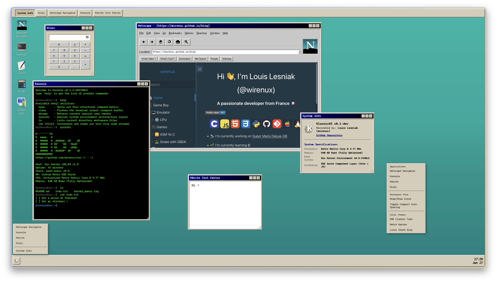
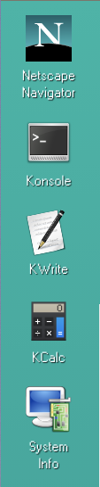
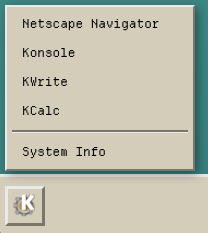

# KlassicOS

A web-based **Operating System** (**OS**) that recreates the classic look and feel of **KDE 1.0** and old computer in general.

KlassicOS is build with `HTML`, `CSS`, and **vanilla** `JavaScript`.

KlassicOS use the retro aesthetic of late-90s Linux environments.








## ⭐ Features

* **Window Management**: Draggable, resizable, and stackable windows with classic 3D borders
* **BIOS Boot Animation**: An animation inspired by old computer startup
* **Taskbar & K-Menu**: A recreation of the application launcher, window focus tracking, and a live system clock
* **Retro Applications**: Includes working recreations of classic software:
* * **Konsole**: A bash-like terminal emulator inspired by my project [NoxOS](https://github.com/wirenux/nox) with file system commands
* * **Netscape Navigator**: A web browser based on the Netscape look
* * **KWrite**: Just a basic text editor.
* * **KCalc**: Just a simple calculator
* **Lightweight Architecture**: Client-side only, bundled with Vite

## 🚀 Live Demo

You can try out **KlassicOS** here: **[Vercel - KlassicOS](https://klassic-os.vercel.app/)**

## 🛠️ Local Development

To run this project locally on your machine:

1. **Clone** the repository on your machine.
```sh
git clone https://github.com/wirenux/klassicos.git
```

2. **Install** the dependencies by running:
```sh
npm install
# or
pnpm install
```

3. **Start** the local Vite server:

```sh
npm run dev
# or
pnpm dev
```

## 🧠 Use of AI

* Gemini: Brainstorming + README.md skeleton

## 💼 Legal

This project is open-source and available under the [MIT License](./LICENSE)

**Trademark Notice:**

KlassicOS is an independent, non-commercial fan project. It is not affiliated with, endorsed by, or sponsored by the KDE community or KDE e.V.

* "KDE" and the K Desktop Environment are registered trademarks of KDE e.V.
* Netscape Navigator and any other third-party software, icons, or brands referenced within this simulation are the properties and trademarks of their respective copyright holders.
* All visual assets and styling are recreated purely for educational purposes, software preservation, and nostalgia.